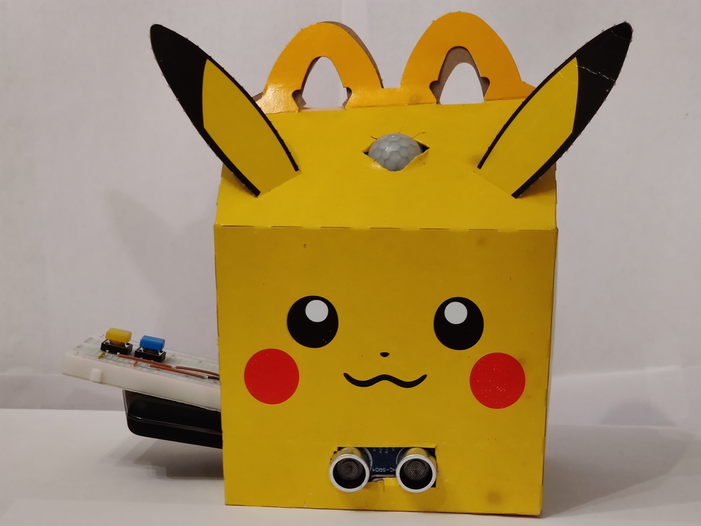

# Seek and Hide <!-- omit in toc -->
## A temporally-distanced hide and seek game. <!-- omit in toc -->

_Note: a clean-background image is also available below. However I felt an image of the device in context was more fitting._

[Video Demo](https://youtu.be/XuIBb4wW9iY)

"Always stay six feet apart." That's the maxim echoed around the world these days. In such isolation, it's difficult to play games such as hide-and-seek or tag with your friends. However, the Seek and Hide aims to capture the joy of such games via distance in time rather than space.

A player connects to the device via Wi-Fi and is guided by a virtual personality with chats with, taunts, and encourages the player to find it. The device senses when the user is in the general area, passes directly by, or is completely lost. Using such information, the virtual personality will tactically jeer at the seeker until it is found.

Once the player finds the Seek and Hide, it's time to hide! The player moves the device to a new location and configures its difficulty, setting up a challenge for the next player and coming to the realization that their own journey was the design of some player prior.

# Setup
## Hardware
The device contains an ESP32 microcontroller which hosts the web server, processes sensor data, and runs the virtual personality. In this specific case, a FreeNove ESP32-WROVER-DEV module was used, although most ESP32 devices should work just as well.

The device also uses an ultrasonic sensor (HC-SR04), a PIR sensor (HC-SR501), and two buttons.

A portable smartphone charger was used to power the ESP32 via USB.

## ESP32 Wiring
__Ultrasonic Sensor__
1. Connect the sensor's VCC pin to the ESP32's 5V pin.
2. Connect the sensor's TRIG pin to the ESP32's pin 13.
3. Connect the sensor's ECHO pin to the ESP32's pin 14.
4. Connect the sensor's GND pin to the ESP32's GND pin.

__PIR Sensor__
1. Connect the sensor's VCC pin to the ESP32's 5V pin.
2. Connect the sensor's OUT pin to the ESP32's pin 15.
3. Connect the sensor's GND pin to the ESP32's GND pin.
4. Tune potentiometer R1 to set the timing duration to slightly above minimum (approx. 10 second hold time).
5. Tune potentiometer R2 to set the sensitivity to the 75% point (approximately 6 meter range).
6. Move the jumper to "H", enabling the repeatable trigger mode.

__Buttons__
1. For each of the two buttons, connect one side to the ESP32's GND pin.
2. Connect the other side of the "upper" button (further away from the enclosing box) to the ESP32's GPIO 18.
3. Connect the other side of the "lower" button (closer to the enclosing box) to the ESP32's GPIO 19.

## Device Enclosure

Any box will suffice for enclosing this device. The buttons were mounted on a breadboard along with the ESP32. The ultrasonic sensor is embedded in the wall of the box facing "outwards" towards the users and the PIR sensor is embedded towards the top, again tilted to face outwards. The end of the breadboard sticks out of the box, providing the user with access to the buttons. In this case, a Pikachu Happy Meal box was used and the battery was stacked underneath the breadboard to mimic Pikachu's tail shape. Using googly eyes or other accessories to give the box some character to match the virtual personality is highly encouraged!

## Dependencies
- Arduino 1.8.13 (other versions may work as well)
- UltrasonicSensor Arduino library
- Wi-Fi enabled portable device (e.g., smartphone, laptop)

## Installation
1. Upload the sketch found in `/ESP32/SeekAndHide` to the ESP32
2. Disconnect the ESP32 from the computer used for programming and connect it to the battery
3. Find a suitable place to hide the device! (See [Tips for Hiding](#tips-for-hiding) for more information)

